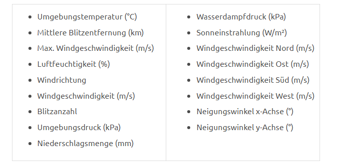

# Braunschweige Opendataset

# Demographie 2023

Auf Ebene von 60 Statistischen Bezirken werden aktuelle Bevölkerungsdaten nach Geschlecht, Staatsangehörigkeit (Deutsch/Nichtdeutsch), Migrationshintergrund und diversen Altersgruppen zur Verfügung gestellt (insgesamt 20 Merkmale).

* [2023](https://opendata.braunschweig.de/dataset/demographie/resource/5eeecad1-792c-4248-a44b-a091b718bc7f#{view-grid:{columnsWidth:[{column:!SBZ60_NAME,width:348}]}})
* [metadata](https://opendata.braunschweig.de/dataset/demographie/resource/a8496032-8c5b-4708-9c5c-be10d6dc8927#{})

## Potential ideas :
we have 3 years of history data : 
* how about consider the trend of demographic data in the past 3 years

# OpenBikeSensor 

Das Projekt OpenBikeSensor ist eine Initiative von Radfahrer:innen, die mit selbstgebauten Sensoren den Überholabstand von Autos messen und die gesammelten Daten der Öffentlichkeit zur Verfügung stellen. Das Ziel ist, die Sicherheit und Popularität des Radfahrens zu erhöhen sowie die generelle Verkehrsinfrastruktur zu verbessern.

[OpenBikeSensor](https://obs.adfc-osnabrueck.de/)

## Potential ideas :
* markdown the dangerous street for bike rider

# Infrastruktur

## Eigenwirtschaftliche Glasfaserausbaugebiete

Die Datei gibt eine Übersicht über den aktuellen Status des eigenwirtschaftlichen Glasfaserausbaus in Braunschweiger Gewerbe- und Wohngebieten mit entsprechenden Informationen zu den jeweiligen Telekommunikationsanbietern. Der eigenwirtschaftliche Ausbau zeichnet sich dadurch aus, dass die Telekommunikationsunternehmen durch Eigeninitiative und mit den eigenen Mitteln Straßenzüge ausbauen. Weitergehende Informationen zum Thema Breitbandausbau finden Sie

[Glasfaserausbaugebiete](https://opendata.braunschweig.de/dataset/eigenwirtschaftliche-glasfaserausbaugebiete)

### Potential ideas :

* check if the area has good internet connection

## Air Quality

Wetterstation Niebelungen-Realschule
An insgesamt 10 Braunschweiger Schulen, über das gesamte Stadtgebiet verteilt wurden Wettermessstationen installiert. 

Im Open Data Portal können jährlich die folgenden Daten abgerufen werden:

# Weather Data

combine the weather data and energy consumption in winter , because lower temperature will increase the energy consumption
which will increase the money spend on energy

# Interessengebiete
Bei dem Datensatz handelt es sich um Karten der Sanierungs-/Fördergebiete der Stadt Braunschweig.

[Interessengebiete](https://opendata.braunschweig.de/dataset/interessengebiete)

### Potential ideas :
* check the area of interest for the real estate investment
* maintenance of the area

# Green Area

https://opendata.braunschweig.de/dataset/rundgang-natur-erleben-riddagshausen